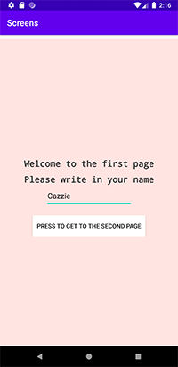
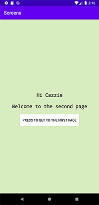

# Rapport

Jag började med att gafflade och clonade Github filen. Sedan skapades en andra aktivitet som fick namnaen SecondActivity. Tanken med appen är att man på startsidan ska skriva in sitt namn, klicka på knappen som då tar en till den andra sidan. Då skickas namnet med till den sidan och skrivs ut där(se figur 1 & 2). Det går sedan att gå tillbaka till den första sidan genom att klicka på knappen på den andra sidan.



**Figur 1:** Första sidan



**Figur 2:** Andra sidan

För att användaren ska skickas med till den andra sidan tillsammans med sitt namn används:

```
firstBtn.setOnClickListener(new View.OnClickListener() {
            @Override
            public void onClick(View view) {
                myNewEdt = (EditText) findViewById(R.id.myNewEdt);
                String N = myNewEdt.getText().toString();
                Intent i = new Intent(MainActivity.this, SecondActivity.class);
                i.putExtra("name" , N);
                startActivity(i);
            }
        });
```
Detta är vad som sker då man klickar på knappen. Först hämtar den värdet (namnet) i en EditText widget som har namnet myNewEdt och efter det omvandlas den till en string. Sedans skapas en Intent som får namnet i som kommer att skicka användaren från sida ett till sida två då man startar den. För att skicka med namnet skickar man med värdet string N i en putExtra. Sist skrivs startActivity(i) in för att starta Intenten och ta användaren till nästa sida.

För att få fram värdet (namnet) på den andra sidan används getIntent().getStringExtra() sedan skrivs det ut i en TextView som här fått namnet msg.

```
msg = findViewById(R.id.textName);
msg.setText("Hi " + getIntent().getStringExtra("name"));
```

